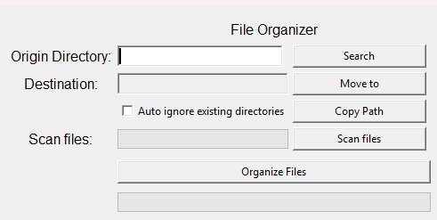

# File Organizer

A simple file organizer built with **Python** and **Tkinter**.  
It allows you to select a source directory and automatically organize files into categories such as documents, images, audio, videos, and more.

---

## Features
- Graphical interface using Tkinter
- Select source and destination directories
- Automatic organization into subfolders:
  - Documents
  - Data files
  - Images
  - Audio
  - Videos
  - Compressed files
  - Executables / installers
  - Others
- Progress bar showing the operation status
- Copy path to clipboard (via **pyperclip**)
- Error handling (missing directory, permission denied, etc.)

---

## Requirements
- pyperclip

---

## Installation
```bash
python -m venv .venv
```

### Activate virtual env (windows)
```bash
source .venv/Scripts/activate.bat # For CMD/Prompt
source .venv/Scripts/Activate.ps1 # For powershell
```

### Activate virtual env (linux/macOS)
```bash
source .venv/bin/activate
```

### Clonning repository
```bash
git clone https://github.com/davisocoloski1/file-organizer.git
cd file-organizer
pip install -r requirements.txt
```
---

## Use

First, run `python main.py`, then this screen will appear



This is the file organizer app, it has various features to help you organize your files into separate folders for each file type

### Chosing your origin directory

In this area you can choose between typing the source path of your files or clicking the "Search" button, which will open the file explorer for you to select the source directory.


### Chosing your destination directory

Just like in the "Origin Directory" area, you can choose the destination directory by clicking the "Move To" button, it will open the file explorer and you can select the directory


### Ignoring existing files

In this area we have 2 checkboxes, the first will automatically ignore existing files and folders in your destination path, the second will show a message that says which folders already exist and asks whether or not the user wants to overwrite them.


### Copying files destination

Next to the checkboxes is the "Copy Path" button, its function is to copy the destination path of your files to the clipboard


### Organize files and progress bar

Finally, you can click the "Organize Files" button, which will locate the files in the source directory and move them to the destination directory. Once you click it, the following events may occur:
- 1 &rarr; If you haven't selected a source or destination directory, a warning message box will appear. The same will happen if one of the directories doesn't exist.
- 2 &rarr; If everything is correct, the progress bar will begin to advance. Once the transfer is complete, the application will display an information message box, notifying you that it is complete.


### Note: the application may crash at times after clicking "Organize Files," so I recommend not clicking on the window until the transfer is complete.
